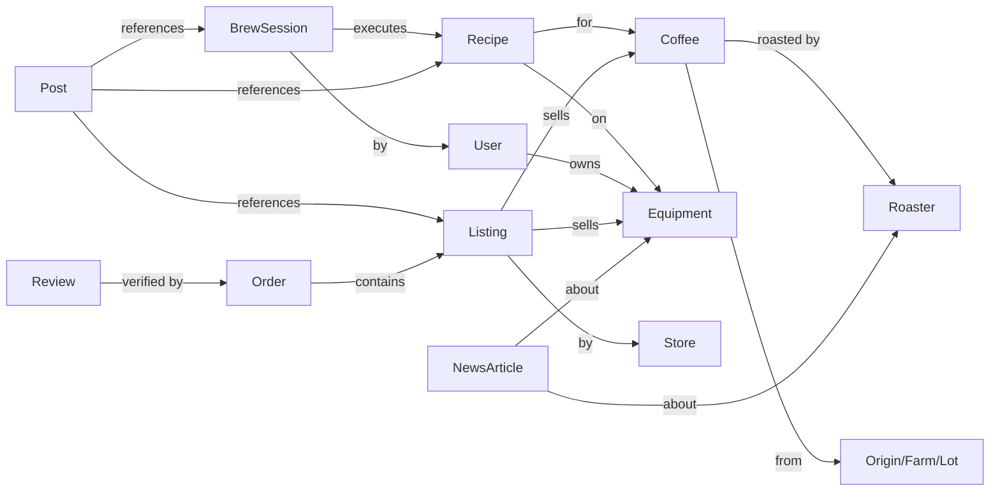

# BrewCult — Community, News and Marketplace Platform (v2)

> Second draft. Supersedes `first_draft.txt`. Structure preserved where it was strong;
> new sections are marked **[NEW]**, materially expanded ones **[EXPANDED]**.

---

# 1. Platform vision

BrewCult combines four interconnected products:

```text
Brewing Intelligence  +  Coffee News  +  Community  +  Marketplace
```

Users can learn about coffee, follow the industry, share brews and recipes, connect with
enthusiasts, roasters and brands, and securely buy or sell coffee and equipment — with AI
recommendations grounded in their actual equipment, taste history and the live marketplace.

**Product statement**

> BrewCult is an AI-powered coffee platform where people discover coffee news, share brewing
> knowledge, improve recipes, connect with the community, and securely buy or sell
> coffee-related products.

**One-line positioning (external):**

> *Buy the right coffee. Brew it right. Every time.*

The platform's defensible core is not any single pillar — it is the **structured entity graph**
(coffee ↔ equipment ↔ recipe ↔ brew ↔ person ↔ listing) that makes each pillar smarter than a
standalone competitor's version of it.

---

# 2. Target users and personas **[NEW]**

The doc previously designed for "coffee people" generically. Each pillar lands differently per
segment, so every feature decision below should name its primary persona.

## 2.1 Personas

### P1 — The Curious Upgrader (largest pool, lowest intent)
- Owns: drip machine or French press, maybe a blade grinder. Spends $10–20/month on coffee.
- Pain: "my coffee is bitter / boring and I don't know why."
- Wants: simple guidance, not a hobby. Will not log brews unless it takes <10 seconds.
- Value to platform: volume, ad/affiliate revenue, conversion funnel into P2.

### P2 — The Prosumer Enthusiast (beachhead persona — build for them first)
- Owns: V60/AeroPress/Moccamaster + a real burr grinder (Encore, Ode, DF64). Scale, maybe a
  gooseneck kettle. Spends $40–120/month on beans and gear.
- Pain: inconsistency ("yesterday's cup was great, today's isn't"), dialing in new bags,
  choice overload when buying beans, grind settings that don't transfer between guides.
- Behavior: already reads r/pourover, watches James Hoffmann/Lance Hedrick, uses or has
  abandoned Beanconqueror. Posts photos. Evangelizes tools that work.
- Value: highest engagement, best content producers, strong purchase intent, the persona
  whose data trains taste models.

### P3 — The Home Barista (espresso)
- Owns: espresso machine ($500–$5,000+), quality grinder. Spends heavily, upgrades often.
- Pain: dialing in is expensive (wasted beans), used-equipment market is fragmented and risky
  (Facebook Marketplace, forums), workflow/recipe knowledge is scattered.
- Value: highest AOV for equipment, prime audience for used-equipment marketplace (Phase 6),
  deepest recipe data (dose/yield/time/pressure).

### P4 — The Professional (barista, roaster, shop owner)
- Pain (roaster side): D2C customer acquisition is brutal; Shopify store + Instagram is the
  default and it's saturated. No channel connects their coffee to people who will brew it well.
- Value: supply side of the marketplace, credibility engine (verified recipes, AMAs),
  editorial sources. Their success stories are the B2B sales narrative.

## 2.2 Persona → pillar mapping

| | Brew Intelligence | News | Community | Marketplace |
|---|---|---|---|---|
| P1 Curious | onboarding quiz, "fix my cup" | light digest | lurker | curated starter kits, affiliate |
| P2 Prosumer | **core user** — dial-in, recipe forking | **core reader** | **core contributor** | bean subscriptions, accessories |
| P3 Home barista | espresso dial-in, waste reduction | gear releases | recipe + gear posts | **used equipment**, upgrades |
| P4 Professional | official recipes for their coffees | **source & subject** | storefront presence | **seller** |

**Design rule:** when a feature decision conflicts across personas, resolve in favor of P2 until
Phase 4 ships, then re-evaluate. P2 is the flywheel: they produce the content that attracts P1,
the demand that attracts P4, and the data that powers the AI.

---

# 3. Market and competitive landscape **[NEW]**

## 3.1 Who already occupies each pillar

| Space | Incumbents | Their weakness BrewCult exploits |
|---|---|---|
| Brew tracking apps | Beanconqueror (FOSS), Filtru, Brewfather-style loggers | Single-player, no commerce, no community, high-friction logging, no AI |
| Coffee community | r/espresso, r/pourover, Home-Barista, CoffeeGeek forums, Discord servers | Unstructured — knowledge evaporates into threads; no entity linking; hostile to beginners |
| Coffee media | Sprudge, Daily Coffee News, Perfect Daily Grind, YouTube creators | No connection to the reader's setup; no commerce loop; discovery is generic |
| Coffee commerce | Trade Coffee (quiz→subscription), Fellow Drops, roaster D2C (Shopify), Amazon | Trade knows taste quiz answers, not brew outcomes; Amazon knows clicks, not grinders; roaster D2C has no discovery |
| Used gear | Facebook Marketplace, r/coffeeswap, forums | No trust layer, no escrow-like protection, no condition standards |

## 3.2 The structural insight

Nobody owns the **closed loop**: *discover → buy → brew → log → share → someone else discovers*.
Trade Coffee owns discover→buy. Beanconqueror owns brew→log. Reddit owns share→discover.
Each hand-off between those products loses the data that would make the next step smarter.
BrewCult's entire bet is owning the loop, which is why Phase ordering (Section 24) matters more
than feature completeness.

## 3.3 Competitive advantage (retained from v1, sharpened)

The marketplace does not beat Amazon on inventory or logistics. It wins on **context**:

- Amazon knows a person viewed a bag of coffee.
- BrewCult knows their brewer, grinder, water, preferred flavor profile, previous coffees,
  successful recipes, roast-level preference, and whether taste-similar users enjoyed this
  coffee — and can hand them a working starting recipe the moment the bag arrives.

The commercial advantage is not selling coffee. It is **removing the risk of buying the wrong
coffee and the frustration of brewing it badly** — the two reasons specialty coffee churn is high.

## 3.4 Honest risks in this landscape

- Beanconqueror is free, open-source, and beloved. Do not compete on logging features; compete
  on what logging *unlocks* (recipes that transfer, purchases that come pre-dialed). Consider
  an import tool for Beanconqueror data as an acquisition wedge.
- Trade Coffee has scale and roaster relationships. BrewCult's counter is depth (brew outcomes)
  over breadth (quiz preferences). Do not race them on catalog size.
- Coffee is a passion niche: total addressable audience for P2/P3 behavior is likely single-digit
  millions globally. The model must work at community scale, not social-network scale — which is
  fine, because take-rate commerce on a passionate niche is a good business (cf. Reverb for
  music gear, which is the closest structural analogue and should be studied directly).

---

# 4. Platform pillars

## Pillar 1: Brew Intelligence
AI-powered coffee assistance · recipe creation · brew diagnostics · recipe optimization ·
equipment-specific guidance · personal and community brewing knowledge.

## Pillar 2: Coffee News
Specialty coffee news · equipment releases · coffee science · industry/market developments ·
competitions and events · sustainability and producer news · roaster announcements ·
platform editorial.

## Pillar 3: Community Feed
Brew posts · recipes · coffee and equipment reviews · questions and discussions · roaster
updates · news discussions · marketplace product posts.

## Pillar 4: Marketplace
Coffee beans · brewing equipment · grinders · accessories · parts · educational products ·
roaster storefronts · verified merchant stores · community sellers where legally and
operationally supported.

---

# 5. Core ecosystem principle — the entity graph

Every platform component connects to structured BrewCult entities. This is the moat; treat it as
a first-class architectural requirement, not a nice-to-have (see Section 20 for implementation).



- A news article about a grinder links to: the grinder profile, compatible recipes, community
  discussions, marketplace listings, AI explanations, and owners of that grinder.
- A coffee listing links to: origin, producer, process, roast profile, community ratings,
  compatible recipes, AI-generated starting recipes, and brew results from verified purchasers.
- A community post can reference: a coffee, roaster, recipe, brew session, equipment, article,
  or listing.

**Rule:** no free-text where an entity reference is possible. Post composers, review forms and
editorial tooling must all offer entity autocomplete. Every unlinked mention is lost graph value.

---

# 6. Coffee domain model **[NEW — coffee-specialist foundations]**

The v1 draft assumed these entities exist. They are the hardest part to get right, and several
have domain subtleties that break naive implementations.

## 6.1 Coffee taxonomy

Model coffee at three levels — conflating them is the #1 data-model error in coffee apps:

```text
CoffeeProduct   — what a roaster sells ("Ethiopia Chelbesa, Washed") — stable identity, SKU-like
  └─ RoastBatch — a specific roast date of that product — freshness lives here
CoffeeLot       — the green coffee behind the product (farm, harvest, process) — provenance lives here
```

Attributes:

- **Provenance (CoffeeLot):** country, region, farm/washing station, producer, altitude (masl),
  varietal(s), harvest period, process (washed / natural / honey / anaerobic / experimental —
  keep as controlled vocabulary + free-text detail).
- **Product (CoffeeProduct):** roaster, name, roast level (controlled scale: light / medium-light
  / medium / medium-dark / dark; optionally Agtron number for pros), intended use (filter /
  espresso / omni), roaster's tasting notes, price band.
- **Batch (RoastBatch):** roast date, bag size(s). Reviews and brew sessions should reference
  the batch when known — a coffee at day 5 and day 50 off roast are different products in the cup.

**Why it matters commercially:** seasonality. Lots sell out and rotate; "Chelbesa 2025 harvest"
must not silently inherit the reviews of the 2024 harvest. Marketplace listings attach to
CoffeeProduct; ratings display with harvest/lot context.

## 6.2 Freshness is a logistics requirement, not metadata

Coffee is the only marketplace category where **shipping time degrades the product**:

- Filter coffee: typically peaks ~4–21 days off roast; espresso often needs 7–14+ days rest.
- Listings must display roast date or roast-to-order policy. "Roasted after you order" is a
  seller badge worth having.
- AI should factor rest time into recommendations ("this bag needs ~5 more days for espresso").
- A "freshness promise" (e.g., ships within N days of roast) is a differentiator vs Amazon that
  costs nothing but enforcement.

## 6.3 Recipes: two schemas, not one

Filter and espresso recipes are structurally different. One generic schema produces junk data.

**Filter / immersion recipe:**
```text
dose (g) · water (g) · ratio (derived) · temperature (°C) · grind (see 6.4)
pour structure: [ {at_time, water_to_weight, note} ]  — bloom is just the first pour
total brew time · brewer (entity) · filter type · optional: agitation notes
```

**Espresso recipe:**
```text
dose in (g) · yield out (g) · ratio (derived) · time (s) · temperature (°C) · grind
optional: pre-infusion, pressure/flow profile [ {at_time, pressure_or_flow} ]
basket size · optional: puck prep (WDT, tamp), RDT
```

**Shared:** target coffee (product or "any light-roast washed"), author, version lineage
(fork graph — see 6.6), difficulty, required equipment.

**Optional pro fields (never required):** TDS %, extraction yield % — refractometer users are
few but they are the highest-credibility contributors; give them fields and badges.

## 6.4 The grinder-setting problem (hardest domain problem — decide early)

"Grind setting 18" means nothing across grinders; even two units of the same model vary.
This breaks naive recipe sharing — the single most valuable interaction in the product.

Layered solution:

1. **Store grind as (grinder entity, setting, scale type)** — never a bare number. Scale type:
   stepped / stepless / rotations+numbers (e.g., "2.6 on Comandante" = 2 rotations 6 clicks).
2. **Coarse category** as universal fallback: extra-fine / fine / medium-fine / medium /
   medium-coarse / coarse. Every recipe must carry this even when a specific setting exists.
3. **Crowd-sourced conversion table:** when a user forks a recipe from grinder A to grinder B
   and confirms a good result, record the (A, setting) → (B, setting) pair. Over time this
   yields empirical conversion curves per grinder pair — data nobody else has, and a genuine
   moat. Seed with published community charts (Honest Coffee Guide etc.) where licensing allows.
4. **AI conversion with explicit uncertainty:** "On your DF64, start around 24 and adjust by
   taste — this conversion is based on 37 community data points (medium confidence)."
   Never present a converted setting as exact.

## 6.5 Water **(deliberately scoped down for v1)**

Water chemistry dominates extraction, but modeling it fully (GH/KH, ion profiles) is a rabbit
hole. v1 scope: an optional water field on brew sessions with presets (tap / filtered / bottled
brand / Third Wave Water-style mineral packet / custom ppm). AI may mention water as a
diagnostic lever ("if adjusting grind doesn't fix flatness, your water may be very soft").
Full water profiles are a later power-user feature, not a launch requirement.

## 6.6 Recipe forking semantics

Forking is git-like and must preserve lineage:

- Fork = copy with `parent_recipe_id`; author changes; upstream attribution is permanent and
  displayed ("forked from @anna's recipe, 2 changes").
- A fork records a **diff** (changed fields), which is what makes the grinder-conversion data
  (6.4) and the AI's "what people change" insights possible.
- "Successful fork" = fork with ≥1 logged brew rated good — this feeds author reputation.

## 6.7 Tasting vocabulary

Novices can't articulate taste — this is a psychology problem with a domain solution:

- Structured result capture: **too bitter / too sour / weak / harsh / just right** plus
  intensity — deliberately simple, mapped internally to extraction theory (sour+weak →
  under-extracted → grind finer / more temp / more time).
- Optional SCA flavor-wheel tag picker for enthusiasts (berry, stone fruit, chocolate, floral,
  nutty…). Controlled vocabulary → comparable data → taste modeling.
- Never require prose tasting notes. The 5-second rating path must exist (see 13.2).

---

# 7. Brew Intelligence (Pillar 1) **[EXPANDED]**

## 7.1 Capabilities

- **Dial-in assistant:** given coffee + equipment + last brew result, propose the next
  adjustment (one variable at a time — teach method, not just answers).
- **Starting-recipe generation:** for any (coffee, equipment) pair — grounded in the roaster's
  official recipe if one exists, community recipes for that coffee, then general priors.
- **Brew diagnostics:** map structured taste feedback (6.7) to extraction causes and fixes.
- **Recipe conversion:** across brewers and grinders, with uncertainty labeling (6.4).
- **Taste modeling:** longitudinal profile from rated brews ("you consistently prefer washed
  Ethiopians brewed slightly coarse") → feeds marketplace matching (Section 15).
- **Explanation on demand:** every recommendation must answer "why?" — trust in the AI is the
  product; opaque answers erode it.

## 7.2 Product principles for the AI

1. **Grounded, not generative:** answers cite entities (recipes, brew logs, articles) from the
   graph. If the graph is silent, say so ("no community data for this coffee on a Switch yet —
   here's my best starting point from similar coffees").
2. **One suggestion at a time** for dial-in — changing three variables teaches nothing and
   makes success unattributable.
3. **Uncertainty is spoken:** confidence language calibrated to data volume.
4. **Commerce firewall:** the AI never lets sponsorship alter a recommendation (Section 17);
   it may disclose "BrewCult earns a fee if you buy this here."

(Implementation architecture: Section 19.)

---

# 8. Coffee News (Pillar 2)

## 8.1 Objective

A trusted, personalized feed of coffee information — not an unfiltered scrape farm.
BrewCult provides: original editorial, summaries of external reporting **with links to the
original**, AI topic summaries with citations, community discussion per story, and
personalization from equipment, interests, and followed entities.

## 8.2 Categories

```text
Coffee science · Brewing techniques · Equipment releases · Product reviews
Roaster announcements · Coffee origins · Farm and producer stories · Industry business
Coffee prices and supply · Sustainability · Climate and agriculture · Competitions
Events · Barista culture · Regulation and trade · Platform announcements
```

## 8.3 Content types

| Type | Source | Review bar |
|---|---|---|
| Original article | BrewCult editorial (staff/commissioned) | Editorial |
| Curated external story | Summary + prominent link to publisher | Editorial |
| News brief | Concise factual update | Editorial |
| Product announcement | Verified manufacturer/merchant/roaster | Verification + labeling |
| Research summary | Practical explanation of academic work | Editorial + citation |
| Community report | User-submitted | Editorial review before publish |
| Automated topic digest | AI summary of several verified sources | Automated + spot-check |

## 8.4 Trust model

Every article displays: content type, author, publisher, publication date, source links,
AI involvement, sponsorship status, editorial review status, correction history.

Labels: `BrewCult Original · External Source · AI-Assisted · Sponsored · Verified Brand ·
Community Submission · Opinion · Research Summary`

Sponsored content must never be presented as independent editorial reporting.

## 8.5 AI news capabilities

Summarize · explain why a development matters · compare reports · identify affected
coffees/regions/equipment · answer questions about an article · connect articles to recipes,
products, discussions · generate personalized daily/weekly briefings · detect duplicate
coverage · flag conflicts for editorial review.

## 8.6 Editorial operations reality **[NEW]**

The v1 draft treated news as a feature; it is an **operating cost and a legal surface**:

- **Copyright:** summarizing external reporting is generally fine with attribution and links;
  wholesale reproduction is not. Summaries must be genuinely transformative, link prominently,
  and honor takedown requests. Get a written policy before launch.
- **Cost:** original editorial needs at least a part-time editor + freelance budget. Until
  then, the honest v1 is: curated summaries + roaster/brand announcements + community reports.
  Do not promise "original reporting" in marketing before staffing it.
- **Cadence beats volume:** one excellent weekly digest (AI-drafted, human-edited) builds more
  habit than ten daily scraped items. The weekly briefing email is also the retention channel
  (Section 13.4).
- News is **Phase 3** for a reason — it needs the community and entity graph to be interesting.

---

# 9. Community Feed (Pillar 3)

## 9.1 Objective

A useful social environment centered on coffee knowledge, discovery and trusted interaction.

Reward: useful recipes, good explanations, verified experience, constructive discussion,
reproducible experiments, high-quality product reviews.
Do not reward: clickbait, unrelated lifestyle content, engagement bait, context-free reposts,
undisclosed commercial promotion.

## 9.2 Post types

```text
Brew result · Recipe · Recipe experiment · Coffee review · Equipment review · Question
Discussion · News reaction · Roaster announcement · Product listing · Store promotion
Event · Poll · Photo · Short video · Educational post
```

## 9.3 Structured brew posts

A brew post optionally includes: coffee, brewer, grinder + setting, recipe, dose, water,
temperature, pour/pulse structure, brew time, tasting result, recipe version, purchase source.
Viewers can: save the recipe, fork it, ask the AI about it, compare with their own equipment,
buy the coffee if available, follow the coffee/roaster/creator.

**Composer rule:** structure is *offered*, never *demanded*. "Photo + one-line caption" must be
a valid post; the composer then nudges ("add your recipe so others can reproduce it — 20
seconds") because posts with structure get the fork/save interactions that reward the author.

## 9.4 Interactions

Like · **Useful** (weighted above Like on technical posts) · Comment · Save · Share · Follow ·
Ask a question · Fork recipe · Mark answer as useful · Report · Purchase linked product ·
Wishlist coffee · Add equipment to profile.

## 9.5 Feed ranking

Inputs: user interests, followed users/roasters, owned equipment, saved coffees, brewing
methods, content quality, author reputation, post usefulness, conversation quality, freshness,
source trust, commercial relevance.

Rules: commercial content must not silently outrank organic; sponsored placements visibly
labeled; **Useful/save/fork signals outweigh raw engagement** — the feed optimizes for "I
brewed better because of this," not time-on-site (this is both ethics and strategy: a
utility-ranked feed is the differentiation from generic social).

## 9.6 Reputation system

Earned through: helpful answers, highly-saved recipes, **successful recipe forks** (6.6),
verified purchases, consistent equipment reviews, accurate corrections, positive marketplace
transactions, knowledge-base contributions.

Badges (verified criteria, never purchasable):
```text
Verified Roaster · Verified Merchant · Barista · Recipe Contributor · Equipment Specialist
Coffee Educator · Producer · Research Contributor · Trusted Seller · Top Reviewer
```

## 9.7 Community health by design **[NEW — psychologist]**

Coffee communities have a known failure mode: **gatekeeping**. "Just buy a $700 grinder" energy
drives away the P1/P2 majority and caps growth. Design against it structurally, not just with
moderation:

- **Norm-setting at signup and in empty states:** "Every great brewer started with bitter
  coffee. Beginner questions are welcome here." Norms shown at the point of action outperform
  buried community guidelines.
- **Beginner-safe spaces:** a "First brews" area where budget-shaming is explicitly moderated;
  route P1 questions there by default.
- **Reward explanations, not verdicts:** "Useful" on answers + "Coffee Educator" badge make
  patient explanation the status behavior. What earns status defines the culture.
- **No public downvote.** Downvotes in expertise communities become gatekeeping weapons.
  Quality sorting comes from positive signals (useful/save/fork) + reports.
- **Anti-snob framing in product copy:** the AI never shames equipment ("a great cup is
  absolutely possible on your setup — here's how").

---

# 10. Behavioral design and retention **[NEW — psychologist]**

The v1 draft had features but no theory of why anyone returns. Coffee has a rare structural
gift: **the habit already exists** — users brew daily. BrewCult doesn't create a habit, it
attaches to one.

## 10.1 The core loop

```text
internal trigger: "about to brew / cup wasn't great"
→ action: 10-second brew log (or "same as yesterday" one-tap repeat)
→ variable reward: AI insight, community response, visible improvement
→ investment: logged history, saved recipes, equipment profile, reputation
→ (investment raises the value of the next trigger)
```

The investment step is the retention engine: after 30 logged brews, taste history and dialed
recipes are assets the user cannot take elsewhere — **earned lock-in** (valuable data, not
hostage data; export must exist, see 18.5, and paradoxically increases willingness to invest).

## 10.2 Motivation model (self-determination theory, applied)

- **Competence** — the primary driver in a skill hobby. Make improvement *visible*: "your last
  5 brews of this coffee rated higher than your first 5," dial-in journey timelines,
  before/after on a new grinder. Progress framing beats points framing.
- **Autonomy** — suggestions, never prescriptions. "Try grinding finer" not "you must."
  Users experiment; the product celebrates experiments ("recipe experiment" post type exists
  for exactly this).
- **Relatedness** — recipe forking is social by construction: "12 people brewed your recipe
  this week" is a stronger reward than 12 likes because it's *usefulness*, not applause.

## 10.3 What to avoid (dark-pattern guardrails)

- **No brew streaks.** Streaks punish vacations and make a pleasure feel like a chore; loss
  aversion is the wrong tool for a relaxation ritual. Use gentle resurfacing instead ("new
  coffee from a roaster you loved").
- **No engagement-bait notifications.** Every push must carry user value (order shipped, your
  question answered, your recipe forked). Weekly digest is opt-out email, not daily push.
- **Careful with public metrics.** Follower counts breed status anxiety and gaming; emphasize
  per-artifact usefulness counts (saves, forks) over per-person clout.
- **Choice overload in commerce:** never show a wall of 200 coffees. Default surface = 3–5
  matched suggestions with reasons + "browse all" escape hatch (see 15.1).

## 10.4 Retention machinery

- **Weekly briefing email:** personalized (your brews, your roasters' drops, best community
  finds). This is the single highest-leverage retention artifact; invest in quality early.
- **Repeat-brew one-tap:** "brew same as last time" logs a session in one tap — keeps the data
  flowing on routine days and keeps the habit hook cheap.
- **Bag lifecycle:** a bag lasts 2–4 weeks. On "bag ending" (estimated from log frequency ×
  dose), trigger the reorder/discover moment — this is where retention meets revenue.
- **Win-back:** "your Kalita has been quiet for 3 weeks — this new Kenyan matches your taste
  profile" beats "we miss you" every time. Always entity-grounded.

---

# 11. Marketplace (Pillar 4)

## 11.1 Objective

Let buyers and sellers transact inside the ecosystem while protecting trust, product quality
and user safety. Support: professional stores, roasters, equipment brands, authorized
distributors, specialty shops, producers/importers where practical, and individual sellers for
approved categories.

## 11.2 Categories

**Initial:** roasted coffee, **coffee subscriptions** (see 11.4), brewers, grinders, scales,
kettles, filters, storage, cleaning, replacement parts, coffee education, digital recipes and
courses.

**Later (after operational review):** green coffee, commercial equipment, roasting equipment,
used professional equipment, events and experiences, cupping sessions, coffee tourism.

Categories with complex legal, food-safety, import or financial requirements ship only after
operational review.

## 11.3 Seller types and verification

| Seller type | May sell | Verification |
|---|---|---|
| Verified roaster | Coffee, subscriptions | Business registration, food-business license where applicable, sample review |
| Verified merchant | Equipment, accessories | Business registration, authorized-dealer proof for brands |
| Verified manufacturer | Official brand store | Brand ownership proof |
| Individual seller | Approved used equipment | Enhanced ID (KYC), transaction limits, payout delays |
| Producer/cooperative | Origin info, approved commercial programs | Origin-side verification partners |

## 11.4 Subscriptions are first-class **[NEW]**

Subscriptions are the core of roaster D2C economics and the platform's best recurring-revenue
and retention product — v1 mentioned them once. Requirements:

- Roaster-defined plans (fixed coffee, roaster's choice rotation, platform-curated rotation).
- **AI-curated subscription** (flagship product): each shipment matched to the user's taste
  model; each bag arrives with a personalized starting recipe; feedback on each bag trains the
  model. This is the Trade Coffee killer — Trade matches on a quiz, BrewCult matches on outcomes.
- Skip/pause/swap without friction (subscription churn comes from inflexibility).
- Billing via payment provider's subscription primitives; per-shipment commission.

## 11.5 Freshness logistics

See 6.2 — listings display roast date or roast-to-order policy; "freshness promise" badge for
sellers meeting ship-within-N-days-of-roast; AI accounts for rest time in "buy again" timing.

---

# 12. Storefronts

Each verified store gets a public profile: name, branding, description, location, shipping
regions, return policy, seller rating, verification status, product catalog, coffee catalog,
news/announcements, community posts, recipes, customer Q&A, buyer's order history, support
contact.

A roaster storefront connects its coffees to: coffee-lot pages, roast batches, official
recipes, community brew results, AI recommendations, availability and shipping info.

**Roaster value proposition (say it plainly, it's the supply-side pitch):** BrewCult customers
churn less because they brew your coffee *well* — the platform ships every bag with a working
recipe and connects buyers to people who already succeeded with it. No other channel does this.

---

# 13. Secure transaction model

## 13.1 Payment processing

Use an established marketplace-capable payment provider — **recommendation: Stripe Connect**
(destination charges + application fees), with Adyen for Platforms as the evaluated
alternative if geographic coverage demands it. Never store card data (SAQ-A scope).

Provider must supply: seller onboarding with KYC/AML, payment processing, platform commission
(application fees), refunds, payout scheduling, transaction reporting, identity verification,
tax document generation (1099-K/DAC7 where applicable), and subscription billing (11.4).

## 13.2 Funds flow and payouts

BrewCult does not claim legal escrow unless implemented through a licensed provider.

```text
Buyer pays via provider → platform records order → seller fulfills
→ provider releases seller payout → BrewCult retains applicable fees
```

Payout delays for: new sellers, high-risk transactions, disputed orders, expensive used
equipment, accounts under review.

## 13.3 Buyer protections

Verified seller indicators · secure platform payments · order tracking · seller response
metrics · clear return policies · dispute submission with evidence upload · refund workflow ·
fraud reporting · review eligibility only after completed transactions · protection against
off-platform payment pressure (warn users when a seller attempts to move payment off-platform;
treat the attempt itself as a seller risk signal).

## 13.4 Seller protections

Verified buyer history where appropriate · shipping evidence support · duplicate-refund-claim
protection · dispute documentation · fraud detection · clear payout status · review appeal
process · seller analytics · inventory and order tools.

## 13.5 Used-equipment safeguards (Phase 6)

Listings require: original photos, condition grade (define a standard: like-new / excellent /
good / fair / for-parts), serial number where appropriate, known defects, repair history,
included accessories, proof of operation for expensive items (video of a pulled shot is the
community norm), shipping/pickup terms. High-value listings require enhanced seller
verification. Model the trust mechanics on Reverb, not eBay.

## 13.6 Tax, compliance, and food law **[NEW]**

- **Sales tax / VAT:** marketplace-facilitator laws make the *platform* liable for collecting
  sales tax in most US states; EU has deemed-supplier rules. Use Stripe Tax or equivalent from
  day one of Phase 4 — retrofitting is painful.
- **Seller income reporting:** 1099-K (US), DAC7 (EU) obligations — provider tooling covers
  most of this; confirm before launch.
- **Food regulation:** roasted coffee is low-risk food, but sellers must hold applicable local
  food-business registrations; verification (11.3) should collect proof. Cross-border coffee
  shipments face customs/agricultural rules — start marketplace **domestic-only per region**.
- **Region strategy:** launch commerce in one country (pick by team's legal home + roaster
  density). Community/news/AI pillars can be global from day one; commerce cannot.

---

# 14. Marketplace monetization

## 14.1 Revenue channels (summary)

| Channel | Phase | Notes |
|---|---|---|
| Transaction commission | 4+ | Category-based %, set by financial modeling, not vibes |
| Payment fee handling | 4+ | Transparent: seller-paid, bundled, or split — pick one and publish it |
| Store subscriptions | 5+ | Free / Professional / Roaster Pro / Brand Enterprise |
| Sponsored placements | 5+ | Product, news, feed, storefront, campaigns — always labeled |
| Affiliate revenue | 2–3 (pre-marketplace!) | Earn on out-links before checkout exists; disclosed |
| Premium user plan | 3+ | Advanced AI, analytics, taste modeling, price alerts, exports |

Paid features never grant trust: verification badges are earned, not bought (applies to
stores and users alike). The free product must remain genuinely useful — community growth is
the asset everything else monetizes.

## 14.2 Unit economics sketch **[NEW — validate with real modeling]**

Directional numbers to frame the fee modeling (US specialty coffee, 2025-ish):

- Coffee order AOV ≈ $22–45; take rate realistically 8–12% on coffee (roaster margins are
  thin — Trade-style 30%+ take rates require owning the customer relationship entirely, which
  conflicts with the storefront model). At 10% take on a $30 AOV → $3/order gross, minus
  ~$1.20 payment costs → **~$1.80 net per coffee order**. Coffee commerce alone won't carry
  the company; it powers the flywheel.
- Equipment AOV ≈ $80–400 new; commission 6–10% → **$5–40/order** — better economics, Phase 5.
- Used equipment (Phase 6): 5–8% transaction fee on $200–3,000 items; Reverb-style economics,
  the best long-term revenue per transaction.
- Subscriptions: recurring commission on ~$20–28/shipment — highest LTV product; prioritize.
- Premium plan: $5–8/month; expect low single-digit % conversion of MAU — meaningful only at
  scale; don't gate core value behind it early.

**Implication:** business viability rests on (a) subscription share of coffee orders,
(b) equipment attach rate, (c) used-equipment marketplace at Phase 6 — not on one-off bean
sales. Model accordingly before setting fees.

## 14.3 Premium user plan

Advanced AI · unlimited recipe optimization · detailed brew analytics · personal taste
modeling · price alerts · product comparison · early access · premium education · larger
history · export and API access.

---

# 15. Marketplace AI

## 15.1 Buyer capabilities

Users can ask: "Which coffee available in Costa Rica matches my taste?" · "Best grinder
upgrade from my current setup?" · "Coffees matching my preferred flavor profile" · "Is this
used listing fairly priced?" · "Who ships this to me?" · "What would materially improve my
setup?"

The AI distinguishes and labels: objective compatibility, community evidence, personal
preference fit, sponsored status, availability. **Default surface is a short matched list with
reasons** ("matches your preference for juicy washed coffees; 9 users with your grinder rated
it highly"), not a catalog dump (see 10.3).

For used gear, "is this fairly priced" is answerable from the platform's own sold-price
history once Phase 6 has volume — another data moat.

## 15.2 Seller capabilities

Create product drafts · generate coffee descriptions · extract details from bag labels
(photo → structured CoffeeProduct fields — big onboarding accelerator for roasters) · create
official brewing recipes · answer common customer questions · summarize customer feedback ·
flag listing problems · suggest inventory opportunities · translate storefront content.
All seller-generated claims remain the seller's responsibility, and AI-assisted listings are
marked internally for moderation sampling.

## 15.3 Paid placement never alters AI recommendations

Restated here because it is the single most trust-critical rule in the product; enforcement
mechanics in Section 17.

---

# 16. AI architecture **[NEW — architect]**

## 16.1 Shape

Provider-agnostic gateway, but concretely: **Anthropic Claude API** as primary.

| Workload | Model tier | Pattern |
|---|---|---|
| Dial-in advice, brew diagnostics, recipe generation | Sonnet-class (default; Opus-class for premium) | Tool use over the entity graph |
| News summarization, digests, dedup | Haiku/Sonnet-class, **Batch API** (50% cost) | Nightly batch jobs |
| Label extraction (bag photo → fields) | Sonnet-class vision | Structured outputs (`output_config.format`) |
| Moderation assist / risk triage | Haiku-class | Structured outputs, human in loop for enforcement |
| Personalized briefings | Batch API | Weekly batch |

Key patterns:

- **Tool use, not fine-tuning:** the assistant calls typed tools — `get_user_setup`,
  `search_recipes`, `get_coffee`, `search_listings`, `get_brew_history`,
  `grind_conversion_lookup`. Answers are grounded in the graph (7.2). The SDK tool-runner
  handles the loop.
- **Structured outputs** for every extraction/classification path (label reading, taste-note
  normalization, moderation flags) — schema-validated, no parsing failures.
- **Prompt caching:** stable system prompt + tool definitions first, per-user context after
  the cache breakpoint; this makes per-conversation cost dominated by the small dynamic slice.
- **Embeddings + vector search** (e.g., pgvector to start) for semantic recipe/coffee/article
  retrieval feeding both search and the AI's tools.
- **Cost guardrails:** per-user daily budget on free tier; premium unlocks heavier usage.
  Log token usage per feature from day one.

## 16.2 Evaluation and safety

- Golden-set evals for dial-in advice (does sour+weak → "grind finer" style reasoning hold?),
  reviewed by a coffee professional; regression-run on every prompt/model change.
- **Commerce-neutrality eval:** an automated test suite that verifies sponsored items never
  rank higher in AI answers than the unsponsored control — this is the enforcement mechanism
  for Section 17 rule 2, not just a policy statement.
- Food-safety adjacent claims (e.g., anything medical about caffeine) route to conservative
  canned guidance.

---

# 17. Advertising and commerce integrity

1. Sponsored content must be labeled.
2. Marketplace commissions must not silently influence AI answers **(enforced by the
   neutrality eval, 16.2)**.
3. Sellers cannot purchase higher review ratings.
4. Paid stores cannot remove legitimate criticism.
5. Affiliate products must be disclosed.
6. Editorial writers must disclose conflicts of interest.
7. AI answers must identify sponsored recommendations.
8. Marketplace availability must never be presented as proof of product quality.

---

# 18. Moderation, safety, and platform policy

## 18.1 Community moderation targets

Spam · harassment · hate speech · dangerous advice · fraud · counterfeits · stolen content ·
undisclosed advertising · manipulated reviews · fake expertise · AI-generated misinformation ·
**gatekeeping/budget-shaming** (a norms violation here, not just bad vibes — see 9.7).

## 18.2 Marketplace prohibitions

Counterfeit products · stolen goods · false descriptions · unsafe electrical equipment ·
expired or misrepresented food · manipulated roast dates · fake tracking · off-platform
payment scams · review manipulation.

## 18.3 Tooling

Automated risk detection (AI-assisted triage, 16.1) · community reports · seller risk scoring
· content and marketplace review queues · appeals · account restrictions · listing/seller
suspension · permanent bans · audit trails. High-impact enforcement requires human review.

## 18.4 Rate limits and abuse **[NEW]**

Post/comment/report rate limits per account age and reputation; new-account friction on
commercial actions; image moderation (CSAM hashing via standard providers, NSFW classifiers)
before public display; review-brigading detection (burst of reviews on one target).

## 18.5 Privacy and data rights **[NEW]**

GDPR/CCPA from day one: export (all brews, recipes, posts — also a trust/lock-in feature,
10.1), deletion with marketplace-record retention carve-outs (transaction records are legally
retained), clear consent for taste-model personalization, no sale of personal data. Taste
models are per-user assets — say so in plain language in the privacy policy; it's a marketing
asset as much as a compliance one.

---

# 19. Review system

Reviews attach to real platform activity:

| Review type | Eligibility |
|---|---|
| Product review | Verified purchase (required for the "verified" label) |
| Seller review | Completed order only |
| Coffee review | Verified purchase, logged brew, or confirmed ownership — labeled accordingly |
| Recipe review | Preferably a recorded brew session ("brewed it" badge on the review) |

Scores display: review count, verified-purchase count, verified-brew count, statistical
confidence (suppress bare 5.0★ with n=2), recent trend, seller response.

**Coffee-specific:** reviews carry brew-method context ("4.8★ as espresso, 3.9★ as filter" are
different facts) and roast-batch date where known (6.1).

---

# 20. Technical architecture **[NEW — architect]**

## 20.1 Shape: modular core, containerized, microservice-ready

*(Refined by `engineering_foundations.md` §7 / ADR-002: everything runs in Docker containers
from day one, deployed as role-based deployables — web, api, worker, scheduler — on a
Compose → managed-Kubernetes path. Swarm rejected. Modules graduate to independent services
only on named triggers.)*

A microservices build-out for a pre-PMF product is self-harm. One codebase, hard module
boundaries, split later along the seams that prove hot:

```text
apps/
  web        — Next.js (or equivalent SSR React) — SEO pages are load-bearing (Section 23)
  mobile     — React Native/Expo — the brew logger must be native-quality fast
api/
  modules/
    identity      — auth, profiles, follows
    catalog       — coffee, equipment, roasters, origins (the entity graph)
    brewing       — recipes, versions/forks, brew sessions
    community     — posts, comments, interactions, reputation
    news          — articles, topics, editorial workflow
    commerce      — stores, listings, carts, orders, payouts, disputes
    intelligence  — AI gateway, tools, taste models, evals
    trust         — moderation, risk, reports, audit
```

- **PostgreSQL** as the system of record (entity graph = normalized relational + a few JSONB
  fields for schema-flexible recipe params). Postgres full-text + pgvector for search/semantic
  until scale demands OpenSearch.
- **Event bus** (transactional outbox → queue; Kafka only when justified) — events like
  `brew.logged`, `order.completed`, `recipe.forked` drive feed fan-out, notifications,
  reputation, taste-model updates without cross-module coupling.
- **Feeds:** fan-out-on-read with per-user ranking at request time + short cache. Fan-out-on-
  write is premature below millions of follows.
- **Media:** object storage + CDN; image pipeline (resize, strip EXIF GPS — privacy).
- **Payments:** commerce module wraps Stripe Connect; **webhook-driven state machine** for
  order/payout status (never trust client redirects); idempotency keys everywhere money moves.
- **Notifications:** one service, per-user channel preferences, digest batching (10.3 rules).

## 20.2 Cross-cutting requirements

- **AuthN/Z:** standard OAuth/email auth; RBAC roles (user, seller-staff, seller-owner,
  moderator, editor, admin); seller staff accounts from day one of Phase 4 (shops have
  employees).
- **API:** REST (Section 22) with cursor pagination, idempotency keys on all POSTs that
  create money-adjacent resources, versioned `/v1`.
- **Observability:** structured logs, tracing, and *product* metrics (Section 25) emitted from
  the same events — one event schema, two consumers.
- **i18n-ready but English-first:** externalized strings from day one; actual localization
  follows commerce region expansion (13.6).

---

# 21. Data model **[COMPLETED — base entities + v1 additions]**

v1 listed only the "additions" and referenced base entities that were never defined. Complete
inventory (fields abbreviated; all tables get `created_at`/`updated_at`):

## 21.1 Identity & social

```text
User            id, handle, email, auth, display_name, bio, location, roles[]
UserEquipment   id, user_id, equipment_model_id, nickname, acquired_at, is_active
Follow          id, follower_id, target_type(user|roaster|coffee|topic), target_id
Notification    id, user_id, type, payload, read_at
ReputationEvent id, user_id, kind, weight, source_type, source_id
Badge / UserBadge
```

## 21.2 Catalog (the entity graph core)

```text
Roaster         id, name, slug, location, verified, store_id?
Origin          id, country, region, description
Farm/Producer   id, origin_id, name, story
CoffeeLot       id, farm_id?, origin_id, varietals[], process, altitude_masl, harvest_period
CoffeeProduct   id, roaster_id, coffee_lot_id?, name, slug, roast_level, intended_use,
                tasting_notes[], status(active|seasonal|discontinued)
RoastBatch      id, coffee_product_id, roast_date
EquipmentBrand  id, name
EquipmentModel  id, brand_id, category(brewer|grinder|kettle|scale|machine|accessory),
                name, specs(jsonb), grind_scale_type?
GrindConversion id, from_model_id, from_setting, to_model_id, to_setting,
                source(user_confirmed|seeded), confidence      -- see 6.4
```

## 21.3 Brewing

```text
Recipe          id, author_id, coffee_product_id?, coffee_style?, method(filter|espresso|immersion),
                brewer_model_id, params(jsonb per 6.3 schema), grind(model_id, setting, coarse_category),
                parent_recipe_id?, version, visibility, is_official(roaster)
RecipeReview    id, recipe_id, user_id, rating, brew_session_id?
BrewSession     id, user_id, recipe_id?, coffee_product_id?, roast_batch_id?, equipment snapshot,
                actual_params(jsonb), water_preset?, result(structured per 6.7), rating, notes, photo?
TasteProfile    id, user_id, model_version, features(jsonb), updated_at    -- derived, rebuildable
```

## 21.4 Community & news (from v1, kept)

```text
FeedPost        id, author_id, post_type, content, visibility,
                coffee_product_id?, recipe_id?, brew_session_id?, equipment_model_id?,
                article_id?, listing_id?
Comment         id, post_id, author_id, parent_comment_id?, content
FeedInteraction id, post_id, user_id, interaction_type(like|useful|save|share|report)
NewsArticle     id, title, slug, summary, content, content_type, author_id, publisher_id,
                publication_date, source_url?, editorial_status, ai_assisted, sponsored,
                sponsor_id?, correction_history(jsonb)
NewsTopic       id, name, description
```

## 21.5 Commerce (from v1, kept + additions)

```text
Store           id, owner_id, store_type, name, description, verification_status, location,
                shipping_regions[], return_policy, rating, status
StoreStaff      id, store_id, user_id, role                                  -- [NEW]
Product         id, store_id, product_type, brand, name, description, condition,
                coffee_product_id?, equipment_model_id?, status
ProductListing  id, product_id, seller_id, price, currency, inventory,
                shipping_profile_id, listing_status, sponsored
ShippingProfile id, store_id, regions, rates(jsonb)                          -- [NEW]
Cart / CartItem                                                              -- [NEW]
SubscriptionPlan id, store_id, cadence, price, type(fixed|roaster_choice|ai_curated)  -- [NEW, 11.4]
Subscription     id, plan_id, buyer_id, status, next_ship_at                 -- [NEW]
Order           id, buyer_id, store_id, status, subtotal, shipping, tax, platform_fee,
                payment_fee, total, currency, payment_provider_reference
OrderItem       id, order_id, listing_id, quantity, unit_price
SellerPayout    id, seller_id, order_id, gross, platform_fee, payment_fee, net, status,
                provider_reference
Dispute         id, order_id, opened_by, reason, description, status, resolution, resolved_at
ProductReview   id, product_id, order_item_id?, reviewer_id, rating, content, verified_purchase
SellerReview    id, store_id, order_id, reviewer_id, rating, content
SponsoredCampaign id, store_id, placement_type, budget, status               -- [NEW, 14.1]
```

## 21.6 Trust & safety **[NEW]**

```text
Report           id, reporter_id, target_type, target_id, reason, status
ModerationCase   id, target_type, target_id, source(report|automated), risk_score,
                 decision, decided_by, audit(jsonb)
SellerRiskScore  id, store_id, score, factors(jsonb), updated_at
```

---

# 22. API resources **[COMPLETED]**

v1's news/feed/stores/marketplace endpoints kept as-is; missing surfaces added:

```text
# Auth & identity                          # Brewing  [NEW]
POST /auth/register|login|refresh          GET/POST       /recipes
GET/PATCH /me                              GET/PATCH/DEL  /recipes/{id}
GET  /users/{handle}                       POST           /recipes/{id}/fork
POST /users/{handle}/follow                GET/POST       /brews
GET/POST/DEL /me/equipment                 GET            /me/taste-profile

# Catalog  [NEW]                           # AI  [NEW]
GET /coffees, /coffees/{slug}              POST /ai/chat            (SSE streaming)
GET /roasters, /roasters/{slug}            POST /ai/starting-recipe
GET /equipment, /equipment/{slug}          POST /ai/diagnose
GET /search?q=&type=                       POST /ai/grind-convert

# News (v1, kept)                          # Feed (v1, kept)
GET /news, /news/{slug}, /news/topics      GET /feed · POST /posts · CRUD /posts/{id}
POST /news, PATCH /news/{id}               POST /posts/{id}/like|save|comments|report
POST /news/{id}/publish|correct

# Stores & marketplace (v1, kept)          # Additions
POST /stores · GET /stores/{slug}          POST /subscriptions · PATCH /subscriptions/{id}
PATCH /stores/{id} · POST /stores/{id}/verify   (skip/pause/swap)
GET /stores/{id}/analytics                 POST /webhooks/payments   (provider events)
GET /marketplace · CRUD /listings          POST /reports
POST /cart/items · POST /checkout          GET  /moderation/queue    (staff)
GET /orders/{id} · POST /orders/{id}/cancel|refund-request|disputes
```

Conventions: `Idempotency-Key` required on checkout/order mutations; cursor pagination;
authenticated rate limits tiered by reputation (18.4).

---

# 23. Growth and go-to-market **[NEW — marketer]**

## 23.1 Sequencing (mirrors delivery phases)

**Phase 1–2 (tool + community): earn P2 trust.**
- **SEO as product:** every public recipe, coffee, and equipment page is a landing page.
  "Best V60 recipe for [coffee]" / "[grinder] setting for espresso" queries have huge intent
  and weak incumbents. This is why web + SSR matters (20.1).
- **Beanconqueror import** as the switcher wedge (3.4).
- Launch beachhead: r/pourover, r/espresso, coffee Discords — as *useful tool*, not ads.
  The grind-conversion feature (6.4) is the shareable hook; it solves a complained-about
  problem weekly on those forums.
- Creator partnerships: mid-tier coffee YouTubers (10–200k subs) — "dial in with me" content
  maps 1:1 to the product. Affiliate codes pre-marketplace.

**Phase 3 (news): the weekly briefing** becomes the brand's voice; growth via forwardable
email quality.

**Phase 4 (marketplace): supply-side first.**
- Hand-recruit 10–20 excellent small/mid roasters in the launch country with white-glove
  onboarding (AI label extraction, 15.2, makes this cheap). Zero commission for 6 months in
  exchange for exclusive drops.
- **Exclusive drops** create demand-side urgency and press ("X roaster's competition lot,
  only on BrewCult, with the champion's recipe attached").
- Demand launch to the existing community: your feed already shows people brewing these
  coffees — the store is just the "get this" button next to proof it's good.

## 23.2 Naming — DECIDED: BrewCult (2026-08-03)

Working name "BrewOS" replaced by **BrewCult**; primary domain **brewcult.coffee**.

- Domain status at decision time (RDAP): `brewcult.coffee`, `.app`, `.co`, `.io` unregistered;
  `.com` registered — register the four available ones immediately, inquire about the `.com`.
- Why: self-aware community identity ("coffee is a cult" is an in-joke the audience already
  makes), merch-native (JOIN THE CULT mugs, numbered CULT MEMBER tees for early adopters,
  rank-named merch tied to reputation badges), and it embodies the belonging/retention thesis
  (Section 10) in a way "OS" never did.
- **Pending before public use:** trademark search (USPTO/EUIPO) in beverage + software classes —
  "cult" + "brew" is common in *beer* branding, the highest-risk collision. Also grab social
  handles (@brewcult) across platforms.
- Tone watch: "cult" is an asset with P2/P3 and indie roasters; monitor whether it creates
  friction with mainstream equipment brands at Phase 5 — partner-facing materials can lead
  with "BrewCult platform" in a neutral register if needed.

## 23.3 Marketing metrics

CAC by channel · activation rate (Section 25 definition) · W1/W4 retention · referral share of
signups · SEO: indexed pages, top-100 keyword count, organic sessions → signup rate ·
briefing email open/CTR · roaster pipeline (contacted → onboarded → first sale).

---

# 24. Delivery phases **[refined: entry/exit criteria added]**

Do not launch the full ecosystem simultaneously.

| Phase | Scope | Exit criteria (move on only when true) |
|---|---|---|
| **1. Brewing intelligence** | Coffee/equipment/roaster catalog, recipes, brew logs, AI assistant, dial-in, grind conversion v1 | Activation: ≥40% of signups log 3+ brews in week 1; dial-in advice rated helpful ≥70%; logging flow ≤15s median |
| **2. Community foundation** | Public profiles, structured posts, comments, saves, follows, forking, reputation signals, moderation v1 | ≥20% of WAU interact (post/comment/fork/save); fork-with-logged-brew loop observed organically; report queue SLA held |
| **3. News & discovery** | Curated news, AI summaries, topic feeds, article discussions, roaster announcements, weekly briefing, affiliate links | Briefing open rate ≥40%; news drives measurable session starts; affiliate revenue > $0 (proves commercial intent) |
| **4. Verified roaster marketplace** | Verified roasters only, roasted coffee + subscriptions, fixed-price, platform payments, shipping, reviews, refunds/disputes, tax | 15+ active roasters; ≥30% of buyers log a brew of a purchased coffee within 14 days (the loop works); dispute rate <2% |
| **5. Equipment marketplace** | Verified merchants, new equipment, accessories, parts, AI product comparison, store subscriptions, sponsored placements | Equipment attach rate on coffee buyers ≥10%; seller NPS healthy |
| **6. Community sellers** | Used equipment, enhanced KYC, condition standards, proof-of-operation, payout delays, expanded disputes | Fraud/dispute rates within modeled bounds at pilot volume before opening categories |

Rationale (kept from v1): starting commerce with verified roasters selling coffee creates the
strongest loop —

```text
User discovers coffee in news/community → reviews the coffee profile → sees compatible recipes
→ purchases from verified roaster → AI creates starting recipe → user logs the brew
→ user publishes the result → other users discover and purchase
```

— and defers the fraud/identity/dispute burden of peer-to-peer sales until the trust systems
have matured on easier categories.

---

# 25. Metrics and North Star

## 25.1 Ecosystem North Star (kept from v1 — it's good)

> **Number of coffees purchased through BrewCult that result in a logged brew, useful community
> contribution, or improved recipe.**

This measures whether commerce strengthens the knowledge system rather than existing as a
bolt-on transaction layer.

## 25.2 Supporting metrics by layer

- **User value:** successful improved brews (rating trend per coffee), AI recommendation
  helpfulness, saved/forked recipes, quality community interactions.
- **Activation (leading):** % of signups reaching "aha" = *3 logged brews + 1 AI interaction
  in week 1* — instrument this exactly.
- **Retention:** W1/W4/W12 cohort retention; brews logged per active user per week.
- **Marketplace:** completed orders, repeat-buyer rate, repeat-seller rate, dispute rate,
  refund rate, verified-purchase review rate, **purchase→logged-brew rate** (the loop metric),
  subscription share of coffee GMV.
- **Health guardrails:** report rate, moderation SLA, beginner-retention delta vs overall
  (if beginners churn faster than average, 9.7 is failing).

---

# 26. Gherkin specifications

Retained from v1 (all scenarios remain valid): personalized news feed, external-summary
disclosure, sponsored labeling, structured brew sharing, AI recipe-compatibility answers,
store verification, secure checkout, off-platform payment rejection, dispute lifecycle,
verified reviews, transparent commercial AI recommendations.

Additions:

```gherkin
Feature: Grind conversion with uncertainty
  Scenario: Convert a recipe to the user's grinder
    Given a recipe specifies "18 clicks" on Grinder A
    And I own Grinder B
    When I open the recipe
    Then I see a suggested starting setting for Grinder B
    And the suggestion displays its confidence and data-point count
    And confirming a good result records a conversion data point

Feature: Freshness-aware purchasing
  Scenario: Roast date on a coffee listing
    Given a listing for a roasted coffee
    When I view the listing
    Then I see the roast date or a roast-to-order commitment
    And the AI notes rest-time guidance if I ask about brewing it on arrival

Feature: Post-purchase brew loop
  Scenario: Starting recipe on delivery
    Given my coffee order is marked delivered
    When I open BrewCult
    Then I am offered an AI starting recipe for that coffee on my equipment
    And logging that brew links the session to my verified purchase

Feature: Beginner-safe community
  Scenario: Budget-shaming reply
    Given a beginner asks a question in First Brews
    When a reply is reported as equipment-shaming
    Then the reply enters the norms moderation queue
    And repeat violations affect the author's reputation
```

---

# 27. Main navigation

Primary: `Home · Brew · AI · Discover · News · Community · Marketplace · Profile`
(consider collapsing News into Discover at launch — eight top-level items is heavy; test.)

Seller accounts additionally: `Store · Products · Orders · Customers · Analytics · Payouts ·
Support`

---

# 28. Risks and open questions **[NEW]**

| # | Risk / question | Mitigation / decision needed |
|---|---|---|
| 1 | Logging friction kills the flywheel — if brew logging isn't ≤15s, nothing downstream works | Treat logger UX as the single most important screen; one-tap repeat; measure time-to-log |
| 2 | Cold-start: AI is thin before community data exists | Phase 1 AI leans on expert priors + roaster official recipes; seed catalog + recipes editorially before public launch |
| 3 | Niche TAM — P2/P3 is millions, not hundreds of millions | Plan for excellent-community-scale economics (Reverb model), not ad-scale; commerce take rate must carry the business |
| 4 | Roaster supply-side chicken-and-egg | Hand-recruited launch cohort, 0% intro commission, exclusive drops (23.1) |
| 5 | Trust collapse from one bad commerce experience early | Over-invest in Phase 4 dispute handling; keep P2P sales out until Phase 6 deliberately |
| 6 | AI cost at free tier | Model-tier routing + batch + caching (16.1), per-user budgets, premium upsell |
| 7 | Editorial/legal exposure on news summaries | Written summary policy, takedown process, editor sign-off (8.6) |
| 8 | Marketplace tax/food compliance per region | Single-country commerce launch; provider tax tooling from day one (13.6) |
| 9 | Grinder conversion data quality (garbage in) | Only record conversions confirmed by a rated-good brew; show confidence; allow flagging |
| 10 | **Open:** launch country for commerce? | Decide by team legal home + roaster density + payment coverage |
| 11 | Platform decided (see `engineering_foundations.md`): web + PWA for Phase 1, native iOS after Phase 2 | API-first + offline sync designed up front so iOS is an additive client, not a re-architecture |
| 12 | Name decided: **BrewCult** / brewcult.coffee (23.2) | Register available domains now; trademark search (esp. beer-space collisions) before public launch |

---

# 29. Final ecosystem statement

> BrewCult connects coffee knowledge, artificial intelligence, community and commerce in one
> trusted platform. Users discover what's happening in coffee, learn from other brewers,
> improve every cup, and securely purchase the products that match their equipment and taste —
> and every purchase makes the next brewer's cup better.
